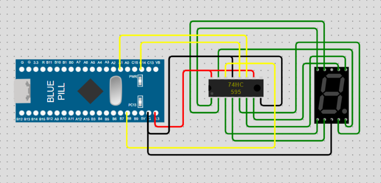

# STM32-Baremetal-7-Segment-counter

## What is Baremetal Programming?
Baremetal programming refers to developing software directly on the hardware without the use of an operating system or high level abstraction libraries such as (HAL/RTOS). In this type of programming the hardware is accessed directly and the peripherals are configured. This is ideal for applications that have a strict memory and timing constraints. It enables full control over time critical operations. Also the absence of overhead from operating system or abstraction layers makes the execution faster and hence resource utilization is optimal.

## The project
This is the 1st project that leverages the barmetal programming capabilities of STM32. The microcontroller particularly used is the ```STM32F103C8T6``` (aka. bluepill). Utilizing STM32F103C8T6 a simple 7 segment counter is created. It also makes use of the 74HC595 which is the 8-bit serial-in, serial or parallel-out shift register with output latches that also has an internal storage register. The storage register buffers the output data which can be clocked independently of the shift register. Thus preventing the data from changing while it is being loaded. It is a SIPO (Serial In Parellel Output) type of a shift register  By making use of the 3 pins namely:
1. ```SH-CP```: Clock pin used to deliver clock signals to the chip when a new data is to be shifted in.
2. ```ST_CP```: Latch pin that is used to display new data/prevent the data from changing when data is being loaded in.
3. ```DS```: Data pin used to send the data bits into the shift register.

## Snaps of the Project
<p align=center>
  
  <p align=center>Schematic</p>
</p>